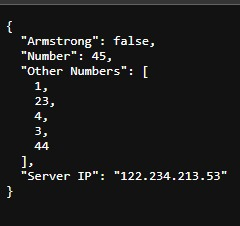

<h1> This is a simple python project made as a part of MLH Global Hack Week Jan'23 challenge </>

## ⚙ What it does - 
- It takes a number as an input.
- It returns True and the data if it's an armstrong number else False if it is not.

## How it works-

- use /armstrong/'the number as an input'
- it will return with data if the the number is an armstrong i.e a valid json return
- here's a screenshot as an example

## 🔧 How we built it-
- Flask
- Jsonify
- Rest API
- GitHub
- And yes of with <3

## 📌 Accomplishments that we're proud of -

I was able to build this project after watching a youtube video on flask. Proud that I did not put myself in a tutorial hell

## 📚 What we learned -
We learnt about Flask and Jsonify and how to make use of all the tools according to the use case of the project.

## ⏭ What's next for -
- A Proper GUI for the project 
- can do hosting of the flask using stable WSGI and apache or any other so as to avoid crashing of server
